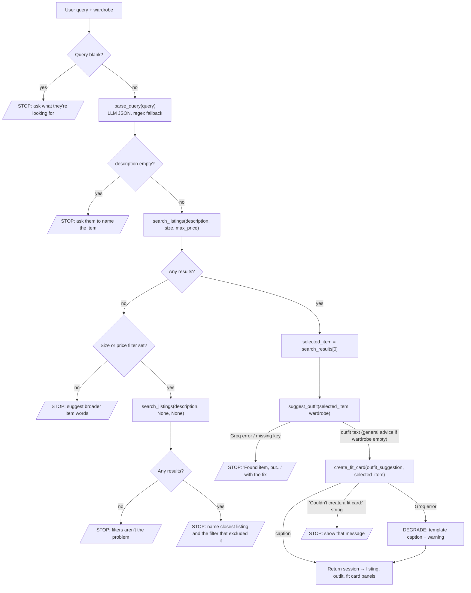

# FitFindr

Demo Link: https://youtu.be/lByIPgT15yE

FitFindr is an agent for secondhand shopping. You describe a piece you want ("vintage graphic tee under $30"). It searches a set of 40 mock Depop/thredUp/Poshmark listings, picks the best match, and suggests outfits using clothes you already own. It then writes a social-media caption ("fit card") for the look.

The interesting part is not the three tools. It's the **planning loop** that decides, at each step, whether to keep going, stop and explain what went wrong, or carry on in a reduced mode. Most of this README is about those decisions.

---

## Setup

**macOS / Linux:**
```bash
python -m venv .venv
source .venv/bin/activate
pip install -r requirements.txt
```

**Windows:**
```bash
python -m venv .venv
source .venv/Scripts/activate
pip install -r requirements.txt
```

Set your Groq API key in a `.env` file in the project root (get a free key at [console.groq.com](https://console.groq.com)):
```
GROQ_API_KEY=your_key_here
# optional — defaults to openai/gpt-oss-120b
GROQ_MODEL=openai/gpt-oss-120b
```

## Running

| Command | What it does |
|---------|--------------|
| `python app.py` | Gradio UI at the localhost URL printed in the terminal (usually http://localhost:7860) |
| `python agent.py` | Runs two CLI cases, a match and a no-results query, and prints which tools were called |
| `python -m pytest tests/` | Tool tests, including every failure mode. Run from the repo root so `from tools import ...` resolves. |

## Project structure

```
ai201-project2-fitfindr-starter/
├── agent.py               # planning loop: run_agent(query, wardrobe) → session dict
├── app.py                 # Gradio UI: handle_query() maps the session to 3 panels
├── tools.py               # parse_query, search_listings, suggest_outfit, create_fit_card
├── planning.md            # the spec: tool contracts, loop steps, diagram, error table
├── tests/test_tools.py    # pytest suite for the tools
├── data/
│   ├── listings.json          # 40 mock secondhand listings
│   └── wardrobe_schema.json   # wardrobe format + example wardrobe + empty wardrobe
├── utils/data_loader.py   # load_listings(), get_example_wardrobe(), get_empty_wardrobe()
└── requirements.txt
```

---

## How the planning loop works

`run_agent(query, wardrobe)` in `agent.py` makes **one pass** through the tools. It is **not** a fixed pipeline. After each step it checks a condition, and the result decides one of three things:

- **Continue:** the step produced what the next tool needs.
- **Stop:** set `session["error"]` to a message that tells the user what to change, then return. No later tool runs.
- **Degrade:** something non-essential failed, so use a fallback, record a warning, and keep going.

Everything the loop learns goes into one `session` dict. The next tool reads its input from the session, so values are passed forward, not re-derived. A run makes at most 3 LLM calls (parse, outfit, caption) and 2 searches.



### The decisions, one at a time

**1. Is there a query at all?**
If the query is empty or whitespace, the agent stops before calling any tool and asks what the user is looking for. Calling the LLM on an empty string would waste a call and return nothing useful.

**2. Can the query be parsed, and how?**
`parse_query` first asks the LLM for strict JSON: `{description, size, max_price}`.
- **Why an LLM:** real queries mix what the user wants with what they already own. In "I'm looking for a vintage graphic tee under $30. I mostly wear baggy jeans and chunky sneakers", only "vintage graphic tee" should be searched.
- **Fallback:** if the call fails, the key is missing, the JSON is invalid, or no item is found, the agent switches to a regex parser. The user sees no message; a warning is recorded.

**3. Did parsing find an item?**
If `description` is still empty (e.g. `"under $20 size M"`), searching would match nothing or everything. The agent stops and asks the user to name the piece.

**4. Did the search find anything? This is the main branch.**
`search_listings` filters by size and price, then scores keyword overlap. It never raises; "no match" is `[]`. When results are empty, the agent does **not** go on to style nothing. Instead it works out *why* the search failed, because the right advice depends on the cause:

| Situation | What the agent does | Why |
|-----------|---------------------|-----|
| No size or price filter was set | Stop and suggest broader item words | The description itself matched nothing, so changing filters can't help |
| Filters were set, and a second search **without** them also finds nothing | Stop and say loosening filters won't help | Avoids sending the user off to remove filters for nothing |
| Filters were set, and the second search finds something | Stop, name the closest listing and the filter that excluded it ("listed as size US 8.5, not 8", "$15.00 over your budget") | Gives the user something concrete to change |

In every case the agent stops. It never passes a near-miss to `suggest_outfit`, because a listing the user filtered out isn't what they asked for.

**5. Which listing gets styled?**
The top-ranked result. There's no second LLM call to re-rank.
- **Ranking inside `search_listings`:** +3 per query word in the title, +2 in style tags, +1 in the description/category/colors/brand. Ties go to the cheaper listing.
- **Color-only matches are dropped.** Without that rule, "black combat boots" would match black biker shorts on the word "black" alone.

**6. Does the wardrobe matter?**
Yes, but an empty wardrobe is **not** a reason to stop. `suggest_outfit` switches to general styling advice ("You haven't added any wardrobe pieces yet, so here are general ways to style it: …"), and the agent continues to the fit card. A new user still gets a useful answer.

**7. What if outfit generation fails?**
A missing `GROQ_API_KEY`, a rate limit, or a connection error **stops** the run, because the fit card is built from the outfit and can't be written without it. The message still names the listing that was found ("Found Graphic Tee — 2003 Tour Bootleg Style ($24.00 on depop), but…") and says what to do next.

**8. What if caption generation fails?**
This **degrades** instead of stopping. By this point the listing and outfit are both valid, so a failed caption shouldn't throw them away. The agent writes a template caption from the listing's title, platform and price, records a warning, and returns all three panels.

The one exception: if `create_fit_card` returns its own "Couldn't create a fit card:" error string (the listing is missing title, price, or platform), the agent treats that as a stop.

**9. When is it done?**
When `session["fit_card"]` is set. There is no retry loop and no follow-up question. Every stop returns a message that tells the user what to type next.

### What actually runs for different inputs

These are real runs; `session["tool_calls"]` records each tool as it's called. The last two rows were produced by replacing the tool with one that raises the Groq exception.

| Input | Tools called | Result |
|-------|--------------|--------|
| `"   "` | *(none)* | Stop: "Tell me what you're looking for…" |
| `"under $20 size M"` | `parse_query` | Stop: "I couldn't tell what item you want…" |
| `"designer ballgown"` | `parse_query`, `search_listings` | Stop: "No listings matched "designer ballgown". Try a broader word…" |
| `"designer ballgown size XXS under $5"` | `parse_query`, `search_listings`, `search_listings (relaxed)` | Stop: "…at any size or price, so loosening your filters won't help…" |
| `"black combat boots size 8"` | `parse_query`, `search_listings`, `search_listings (relaxed)` | Stop: "…closest listing without your filters is Suede Chelsea Boots — Tan — $44.00, size US 8.5… It's listed as size US 8.5, not 8…" |
| `"90s track jacket under $30"` | `parse_query`, `search_listings`, `search_listings (relaxed)` | Stop: "…90s Track Jacket — Navy/White Stripe — $45.00… It's $15.00 over your budget…" |
| `"vintage graphic tee under $30"`, example wardrobe | `parse_query`, `search_listings`, `suggest_outfit`, `create_fit_card` | All three panels |
| `"vintage graphic tee under $30"`, empty wardrobe | `parse_query`, `search_listings`, `suggest_outfit`, `create_fit_card` | All three panels; outfit panel has general styling advice |
| Same query, Groq connection error in `suggest_outfit` | `parse_query`, `search_listings`, `suggest_outfit` | Stop: "Found Graphic Tee… but I couldn't reach the outfit generator (APIConnectionError)…" |
| Same query, Groq connection error in `create_fit_card` | `parse_query`, `search_listings`, `suggest_outfit`, `create_fit_card` | All three panels; caption is the template; `warnings` records it |

### State: what the session holds

| Key | Written when | Used by |
|-----|--------------|---------|
| `query`, `wardrobe` | session created | `parse_query`, `suggest_outfit` |
| `parsed` | after `parse_query` | `search_listings`, no-results messages |
| `parse_method` | after `parse_query` | debugging (`"llm"` or `"regex"`) |
| `search_results` | after `search_listings` | selection; listing panel ("best of 20 matches") |
| `relaxed_results` | only after an empty search with filters | the "closest listing" message |
| `selected_item` | after a non-empty search | `suggest_outfit`, `create_fit_card`, listing panel |
| `outfit_suggestion` | after `suggest_outfit` | `create_fit_card`, outfit panel |
| `fit_card` | after `create_fit_card` | fit card panel |
| `warnings` | when a step degraded | CLI/debugging |
| `tool_calls` | just before each tool call | shows which tools ran |
| `error` | on any stop | `app.py`: shown in the first panel, other panels left empty |

Values are passed by reference, not copied or re-fetched. In the walkthrough run below, `session["selected_item"]` was the same object as `search_listings(...)[0]` and as the `new_item` passed to both `suggest_outfit` and `create_fit_card` (identical `id()`). `session["outfit_suggestion"]` was the same string that `create_fit_card` received.

---

## Tool Inventory

Signatures match `tools.py` exactly.

### `search_listings(description: str, size: str | None = None, max_price: float | None = None) -> list[dict]`
- **Inputs:**
  - `description`: item keywords, e.g. `"vintage graphic tee"`.
  - `size`: the user's size as written. `None` skips the size filter. `"M"` matches `"S/M"`; `"8"` matches `"US 8"` but not `"US 8.5"`; "One Size" listings always match.
  - `max_price`: inclusive ceiling. `None` skips the price filter.
- **Returns:** matching listing dicts, best first. Each has `id, title, description, category, style_tags, size, condition, price, colors, brand, platform`, plus an added `match_score` (int). Returns `[]` when nothing matches and never raises for no results. No LLM call.

### `suggest_outfit(new_item: dict, wardrobe: dict) -> str`
- **Inputs:**
  - `new_item`: a listing dict.
  - `wardrobe`: `{"items": [{id, name, category, colors, style_tags, notes}, ...]}`. An empty list, a missing `items` key, or `None` all count as an empty wardrobe.
- **Returns:** always a non-empty string.
  - With a wardrobe: 1–2 lines of `Outfit N: <item title> + <wardrobe piece> + ... — <why it works>`, using wardrobe names verbatim.
  - With an empty wardrobe: general styling advice starting "You haven't added any wardrobe pieces yet…".
  - If the LLM returns no text: a fixed fallback outfit line.
- **Raises:** `ValueError` (missing API key) or `groq.APIError` subclasses. The planning loop turns these into messages.

### `create_fit_card(outfit: str, new_item: dict) -> str`
- **Inputs:**
  - `outfit`: the string from `suggest_outfit`.
  - `new_item`: the same listing dict; needs `title`, `price`, `platform`.
- **Returns:** a 2–4 sentence lowercase caption mentioning the item, price, and platform once each, at temperature 1.0 so it varies.
  - If `outfit` is empty, whitespace, or `None`, or the listing is missing fields, it returns an error string starting `"Couldn't create a fit card:"` without calling the LLM.
  - If the LLM returns no text, it returns a template caption.
- **Raises:** `ValueError` / `groq.APIError` on API failure.

### `parse_query(query: str) -> tuple[dict, str]`
- **Input:** the raw user message.
- **Returns:** `({"description": str, "size": str | None, "max_price": float | None}, method)`, where `method` is `"llm"` or `"regex"`. It never raises: API errors, a missing key, or bad JSON all fall back to the regex parser. `description` can be `""`, which the planning loop treats as a stop.

### Entry point: `run_agent(query: str, wardrobe: dict) -> dict` (agent.py)
Runs the planning loop and returns the session dict. Check `session["error"]` first: when it's set, `outfit_suggestion` and `fit_card` are `None`.

---

## Interaction Walkthrough

**User query:** "I'm looking for a vintage graphic tee under $30. I mostly wear baggy jeans and chunky sneakers. What's out there and how would I style it?" (Wardrobe: **Example wardrobe**)

The query isn't blank, so the loop continues to parsing.

**Step 1 — Tool called:**
- **Tool:** `parse_query`
- **Input:** the full query above.
- **Why this tool:** `search_listings` needs clean arguments, and this query mixes the item wanted with items already owned.
- **Output:** `{"description": "vintage graphic tee", "size": None, "max_price": 30.0}`, method `"llm"`.
  - "baggy jeans and chunky sneakers" was correctly left out, since the wardrobe supplies those.
  - No size was given, so `size` is `None`.
  - `description` isn't empty, so the loop continues.

**Step 2 — Tool called:**
- **Tool:** `search_listings`
- **Input:** `("vintage graphic tee", None, 30.0)`
- **Why this tool:** find real listings before styling anything.
- **Output:** 20 listings at or under $30. The top three:

  | id | title | price | size | score |
  |----|-------|-------|------|-------|
  | lst_006 | Graphic Tee — 2003 Tour Bootleg Style | $24.00 | L | 15 |
  | lst_033 | Vintage Band Tee — Faded Grey | $19.00 | L | 14 |
  | lst_015 | Vintage Graphic Hoodie — Faded Black | $26.00 | L | 12 |

  - **The decision:** results aren't empty, so the no-results recovery is skipped and `selected_item = lst_006` (depop, good condition).
  - Its score of 15 = "vintage" (tags +2, description +1) + "graphic" (title +3, tags +2, description +1) + "tee" (title +3, tags +2, description +1).

**Step 3 — Tool called:**
- **Tool:** `suggest_outfit`
- **Input:** `new_item` = the `lst_006` dict from the session, `wardrobe` = the 10-item example wardrobe.
- **Why this tool:** the user asked how to style it, and they own pieces to build around.
- **Output:** the wardrobe isn't empty, so the tool used wardrobe mode:
  ```
  Outfit 1: Graphic Tee — 2003 Tour Bootleg Style + Baggy straight-leg jeans, dark wash + Black combat boots + Black crossbody bag — The faded graphic pairs with the relaxed denim and rugged boots for a gritty street‑wear look, while the crossbody adds functional edge.
  Outfit 2: Graphic Tee — 2003 Tour Bootleg Style + Wide-leg khaki trousers + Vintage black denim jacket + Chunky white sneakers — The contrast of the khaki pants with the black tee and denim jacket creates a balanced vintage vibe, and the chunky sneakers keep the outfit contemporary and comfortable.
  ```
  No Groq error occurred, so the loop continues.

**Step 4 — Tool called:**
- **Tool:** `create_fit_card`
- **Input:** `outfit` = the Step 3 string from the session, `new_item` = the same `lst_006` dict.
- **Why this tool:** turn the find and the look into a shareable caption.
- **Output:** *"found this graphic tee for $24 on depop and it instantly became my go‑to vibe. i pair it with baggy straight‑leg jeans, black combat boots and a crossbody for a gritty street‑wear feel, then flip it with wide‑leg khaki trousers, a vintage denim jacket and chunky white sneakers for a relaxed retro twist. 🖤 #thrifting #ootd"*

**Final output to user:**
`session["error"]` is `None`, so `handle_query` fills all three panels:
- **🛍️ Top listing found:**
  ```
  Graphic Tee — 2003 Tour Bootleg Style
  $24.00 · depop · size L · good condition
  Vintage-style bootleg tee with faded graphic. Slightly boxy fit. 100% cotton, soft and worn-in.
  (best of 20 matches)
  ```
- **👗 Outfit idea:** the two outfit lines from Step 3.
- **✨ Your fit card:** the caption from Step 4.

The LLM wording changes from run to run. The parse, search results, and selected listing don't.

---

## Error Handling and Fail Points

| Tool | Failure mode | Agent response |
|------|-------------|----------------|
| *(planning loop)* | Query is empty or whitespace | **Stop, no tools called.** "Tell me what you're looking for — for example: "vintage graphic tee under $30, size M"." |
| `parse_query` | LLM call fails, key missing, or JSON invalid / has no item | **Degrade.** Silently uses the regex parser; records a warning. |
| `parse_query` | No item could be extracted at all (e.g. "under $20 size M") | **Stop.** "I couldn't tell what item you want from "under $20 size M". Name the piece — for example "graphic tee", "cargo pants", or "chelsea boots" — and add a size or price if you like." |
| `search_listings` | No results, and the user set no size/price filter | **Stop; outfit tools never run.** "No listings matched "{description}". Try a broader word for the item (e.g. "dress", "blazer", "boots") — we carry tops, bottoms, outerwear, shoes, and accessories." |
| `search_listings` | No results because of a filter; a search without filters finds something | **Stop; outfit tools never run.** Names the closest listing and the filter that excluded it, e.g. "Nothing matched "black combat boots" in size 8. The closest listing without your filters is Suede Chelsea Boots — Tan — $44.00, size US 8.5, on poshmark. It's listed as size US 8.5, not 8. Search again without those filters to see it." |
| `search_listings` | No results even without filters | **Stop; outfit tools never run.** "No listings matched "ballgown" at any size or price, so loosening your filters won't help. Try a broader word for the item (e.g. "dress", "blazer", "boots")." |
| `suggest_outfit` | Wardrobe is empty | **Not an error.** Returns general styling advice starting "You haven't added any wardrobe pieces yet…"; the agent continues to the fit card. |
| `suggest_outfit` | LLM returns empty text | **Degrade.** Returns a fixed outfit line built from the wardrobe's first bottoms and shoes. |
| `suggest_outfit` | `GROQ_API_KEY` not set | **Stop.** "Found {title} (${price} on {platform}), but outfit ideas need the Groq API and GROQ_API_KEY isn't set. Add GROQ_API_KEY=your_key to a .env file in the project root and restart the app." |
| `suggest_outfit` | Groq rate limit | **Stop.** "Found {title} (…), but Groq's rate limit was hit while generating outfit ideas. Wait about 30 seconds and search again." |
| `suggest_outfit` | Connection or other Groq API error | **Stop.** "Found {title} (…), but I couldn't reach the outfit generator ({ExceptionName}). Check your internet connection and search again." |
| `create_fit_card` | Outfit string is empty, whitespace, or `None` | Returns "Couldn't create a fit card: no outfit suggestion was provided for this item." without calling the LLM. The agent only calls it with a real outfit, so this is a safeguard; it's covered by tests. |
| `create_fit_card` | Listing is missing `title` / `price` / `platform` | **Stop.** Shows "Couldn't create a fit card: the listing is missing {fields}." |
| `create_fit_card` | Groq API error, or LLM returns empty text | **Degrade.** Template caption, e.g. "thrifted this graphic tee off depop for $24 and it already has a spot in my rotation."; a warning is recorded; listing and outfit panels are unaffected. |

---

## Spec Reflection

**One way planning.md helped during implementation:**
The Tool 1 spec recorded exact expected results before any code existed: 20 results for "vintage graphic tee" under $30 with `lst_006` first, and `[]` for "black combat boots" in size 8. That meant `search_listings` could be checked against concrete numbers instead of "looks reasonable". The same numbers became assertions in `tests/test_tools.py`. Likewise, the error table's exact message strings were copied straight into `agent.py`, so the messages users see match the spec word for word.

**One divergence from your spec, and why:**
The spec named a Llama model on Groq, but no Llama chat models were available to this API key (the request returned `model_not_found`). The code uses `openai/gpt-oss-120b` instead, configurable through `GROQ_MODEL`. It's a reasoning model, and the first test calls came back with **empty** text: the hidden reasoning used up the whole `max_tokens` budget. The fix was passing `reasoning_effort="low"` and raising the token limits (outfit 400 → 1024, caption 150 → 512). A second divergence came from testing: the model shortened "Baggy straight-leg jeans, dark wash" to "Baggy straight-leg jeans", treating the comma as a separator. Wardrobe names are now quoted in the prompt. planning.md was updated to match both changes.

---

## Known limitations

- **One pass, no follow-up questions.** A vague query gets a stop message, not a clarifying question.
- **Only the top listing is styled.** The other matches count toward "best of N matches" but aren't shown.
- **Keyword scoring is simple.** Weak matches can appear lower in the results. "track jacket" in size M also returns a shacket with a score of 1, though the real track jacket ranks first.
- **LLM output varies between runs.** The outfit format and caption rules are enforced by the prompt, not by parsing the output.
